# Mermaid Diagramming

Create professional software diagrams using Mermaid's text-based syntax. Mermaid renders diagrams from simple text definitions, making diagrams version-controllable, easy to update, and maintainable alongside code.

## Core Syntax Structure

All Mermaid diagrams follow this pattern:

```mermaid
diagramType
  definition content
```

**Key principles:**
- First line declares diagram type (e.g., `classDiagram`, `sequenceDiagram`, `flowchart`)
- Use `%%` for comments
- Line breaks and indentation improve readability but aren't required
- Unknown words break diagrams; parameters fail silently

## Diagram Type Selection Guide

**Choose the right diagram type:**

1. **Class Diagrams** - Domain modeling, OOP design, entity relationships
   - Domain-driven design documentation
   - Object-oriented class structures
   - Entity relationships and dependencies

2. **Sequence Diagrams** - Temporal interactions, message flows
   - API request/response flows
   - User authentication flows
   - System component interactions
   - Method call sequences

3. **Flowcharts** - Processes, algorithms, decision trees
   - User journeys and workflows
   - Business processes
   - Algorithm logic
   - Deployment pipelines

4. **Entity Relationship Diagrams (ERD)** - Database schemas
   - Table relationships
   - Data modeling
   - Schema design

5. **C4 Diagrams** - Software architecture at multiple levels
   - System Context (systems and users)
   - Container (applications, databases, services)
   - Component (internal structure)
   - Code (class/interface level)
   - Deployment (infrastructure nodes)
   - Dynamic (request flows, numbered sequences)

6. **State Diagrams** - State machines, lifecycle states
7. **Git Graphs** - Version control branching strategies
8. **Gantt Charts** - Project timelines, scheduling
9. **Pie/Bar Charts** - Data visualization

## Quick Start Examples

### Class Diagram (Domain Model)
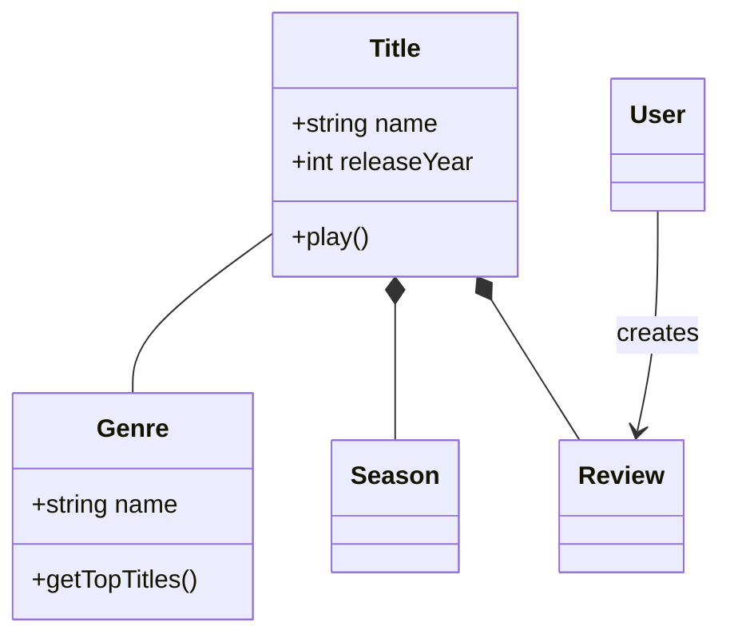

### Sequence Diagram (API Flow)
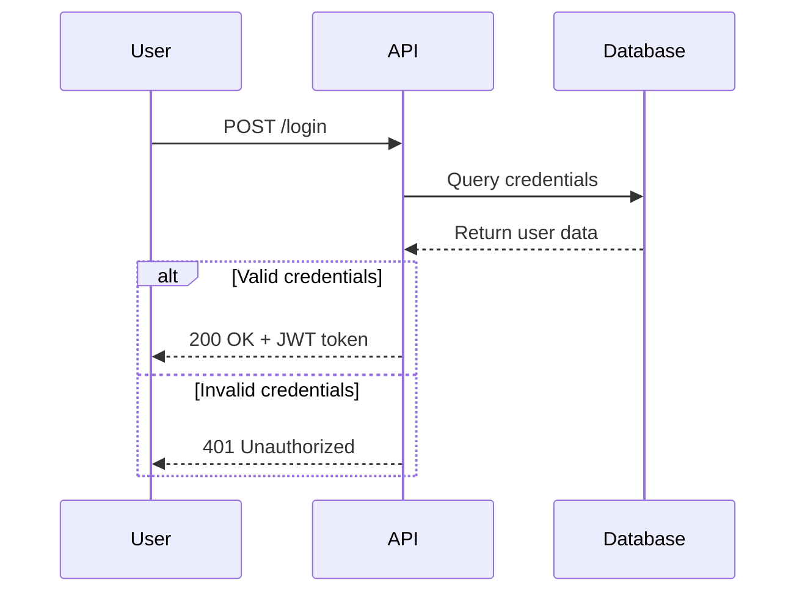

### Flowchart (User Journey)
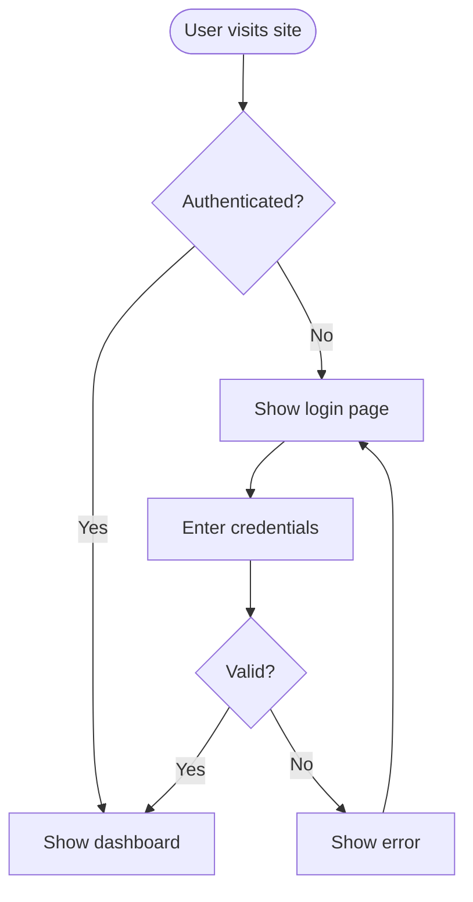

### ERD (Database Schema)
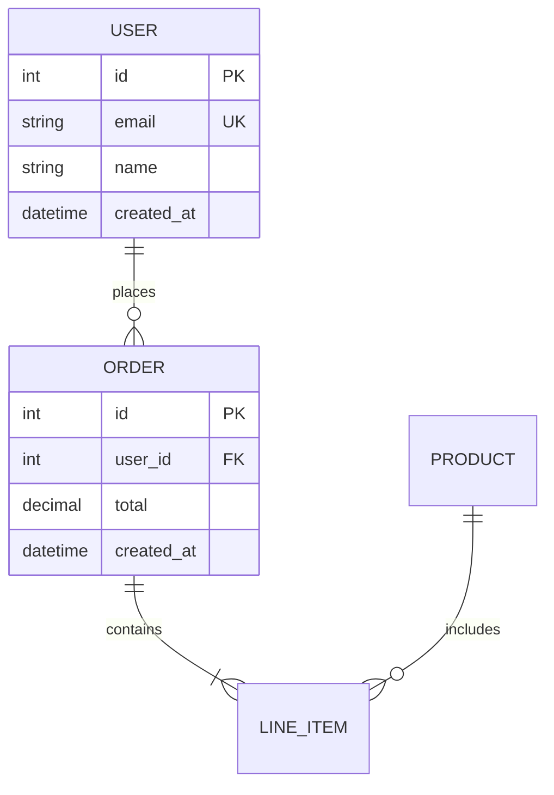

## C4 Architecture Diagrams

The C4 model provides a hierarchical way to visualize software architecture. Generate architecture documentation using C4 model diagrams in Mermaid syntax.

### C4 Workflow

1. **Understand scope** -- Determine which C4 level(s) are needed based on audience
2. **Analyze codebase** -- Explore the system to identify components, containers, and relationships
3. **Generate diagrams** -- Create Mermaid C4 diagrams at appropriate abstraction levels
4. **Document** -- Write diagrams to markdown files with explanatory context

### C4 Diagram Levels

Select the appropriate level based on the documentation need:

| Level | Diagram Type | Audience | Shows | When to Create |
|-------|-------------|----------|-------|----------------|
| 1 | **C4Context** | Everyone | System + external actors | Always (required) |
| 2 | **C4Container** | Technical | Apps, databases, services | Always (required) |
| 3 | **C4Component** | Developers | Internal components | Only if adds value |
| 4 | **C4Deployment** | DevOps | Infrastructure nodes | For production systems |
| - | **C4Dynamic** | Technical | Request flows (numbered) | For complex workflows |

**Key Insight:** "Context + Container diagrams are sufficient for most software development teams." Only create Component/Code diagrams when they genuinely add value.

### Audience-Appropriate Detail

| Audience | Recommended Diagrams |
|----------|---------------------|
| Executives | System Context only |
| Product Managers | Context + Container |
| Architects | Context + Container + key Components |
| Developers | All levels as needed |
| DevOps | Container + Deployment |

### C4 Quick Start Examples

#### System Context (Level 1)
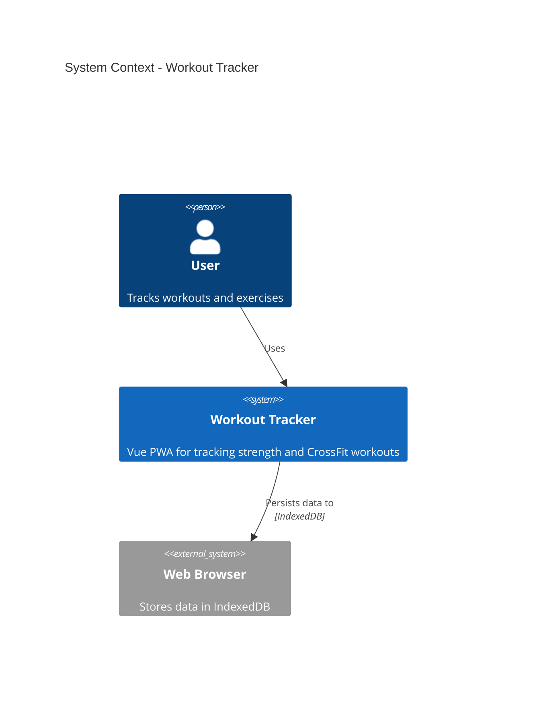

#### Container Diagram (Level 2)
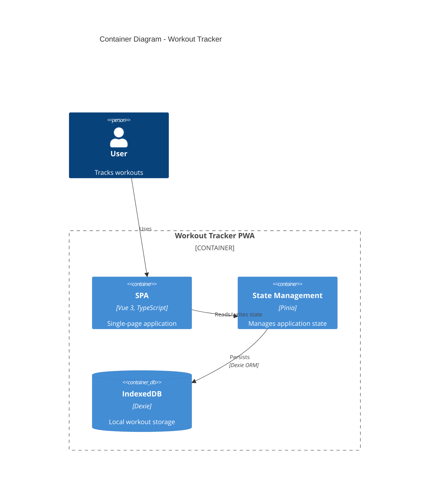

#### Component Diagram (Level 3)
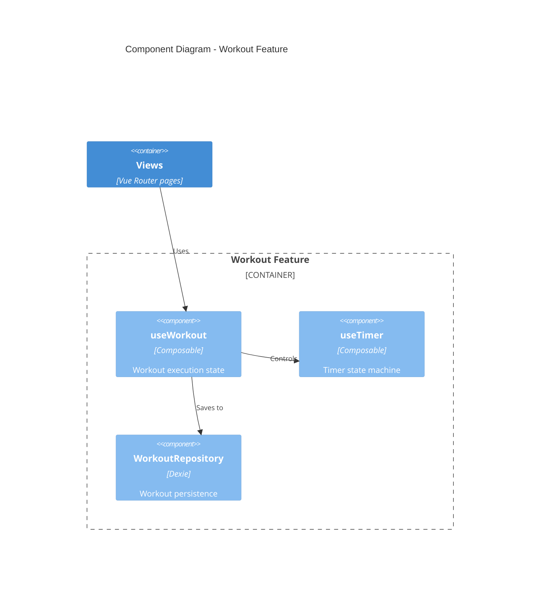

#### Dynamic Diagram (Request Flow)
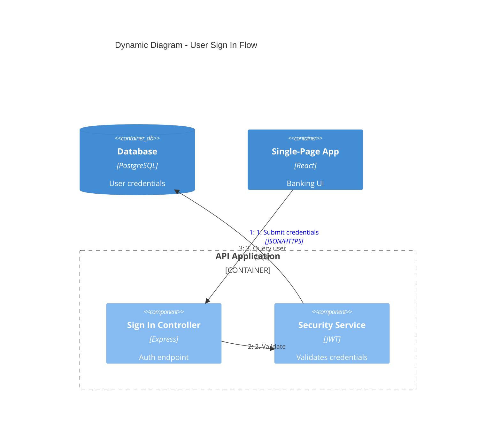

#### Deployment Diagram
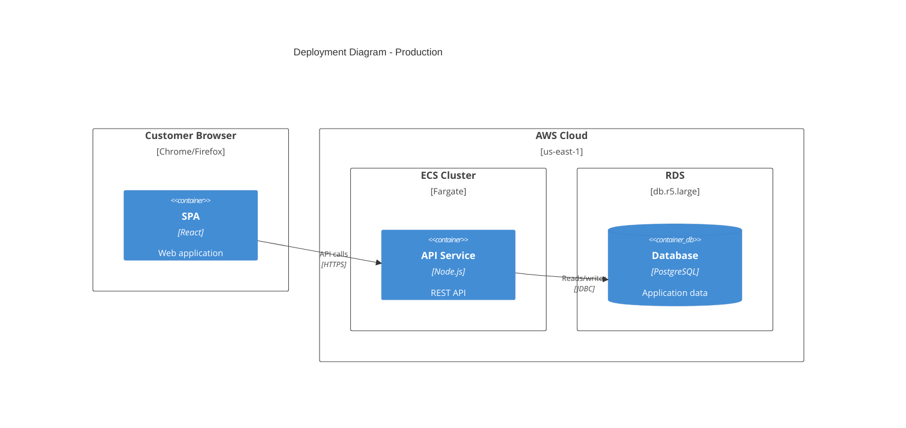

### C4 Element Syntax

**People and Systems:**
```
Person(alias, "Label", "Description")
Person_Ext(alias, "Label", "Description")       # External person
System(alias, "Label", "Description")
System_Ext(alias, "Label", "Description")       # External system
SystemDb(alias, "Label", "Description")         # Database system
SystemQueue(alias, "Label", "Description")      # Queue system
```

**Containers:**
```
Container(alias, "Label", "Technology", "Description")
Container_Ext(alias, "Label", "Technology", "Description")
ContainerDb(alias, "Label", "Technology", "Description")
ContainerQueue(alias, "Label", "Technology", "Description")
```

**Components:**
```
Component(alias, "Label", "Technology", "Description")
Component_Ext(alias, "Label", "Technology", "Description")
ComponentDb(alias, "Label", "Technology", "Description")
```

**Boundaries:**
```
Enterprise_Boundary(alias, "Label") { ... }
System_Boundary(alias, "Label") { ... }
Container_Boundary(alias, "Label") { ... }
Boundary(alias, "Label", "type") { ... }
```

**Relationships:**
```
Rel(from, to, "Label")
Rel(from, to, "Label", "Technology")
BiRel(from, to, "Label")                        # Bidirectional
Rel_U(from, to, "Label")                        # Upward
Rel_D(from, to, "Label")                        # Downward
Rel_L(from, to, "Label")                        # Leftward
Rel_R(from, to, "Label")                        # Rightward
```

**Deployment Nodes:**
```
Deployment_Node(alias, "Label", "Type", "Description") { ... }
Node(alias, "Label", "Type", "Description") { ... }  # Shorthand
```

### C4 Styling and Layout

**Layout Configuration:**
```
UpdateLayoutConfig($c4ShapeInRow="3", $c4BoundaryInRow="1")
```
- `$c4ShapeInRow` -- Number of shapes per row (default: 4)
- `$c4BoundaryInRow` -- Number of boundaries per row (default: 2)

**Element Styling:**
```
UpdateElementStyle(alias, $fontColor="red", $bgColor="grey", $borderColor="red")
```

**Relationship Styling:**
```
UpdateRelStyle(from, to, $textColor="blue", $lineColor="blue", $offsetX="5", $offsetY="-10")
```
Use `$offsetX` and `$offsetY` to fix overlapping relationship labels.

### Microservices Guidelines

#### Single Team Ownership
Model each microservice as a **container** (or container group):
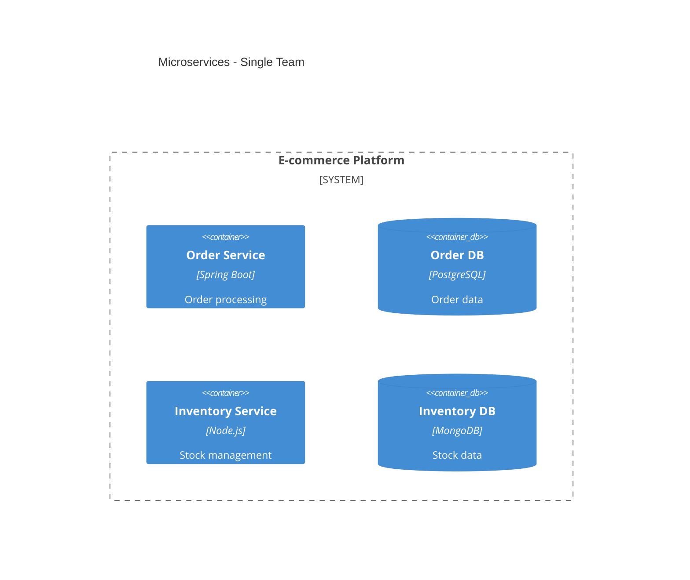

#### Multi-Team Ownership
Promote microservices to **software systems** when owned by separate teams:
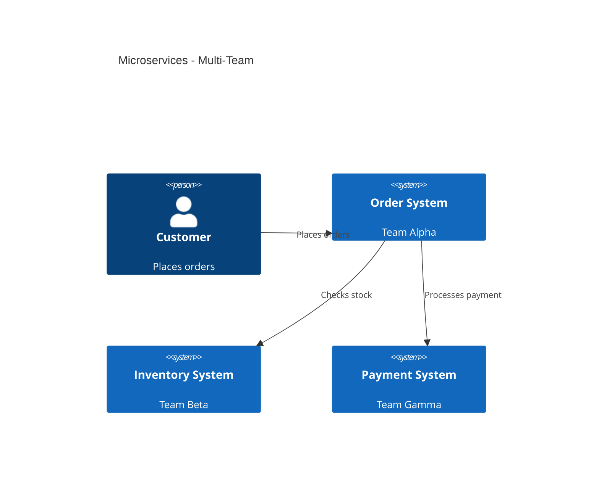

#### Event-Driven Architecture
Show individual topics/queues as containers, NOT a single "Kafka" box:
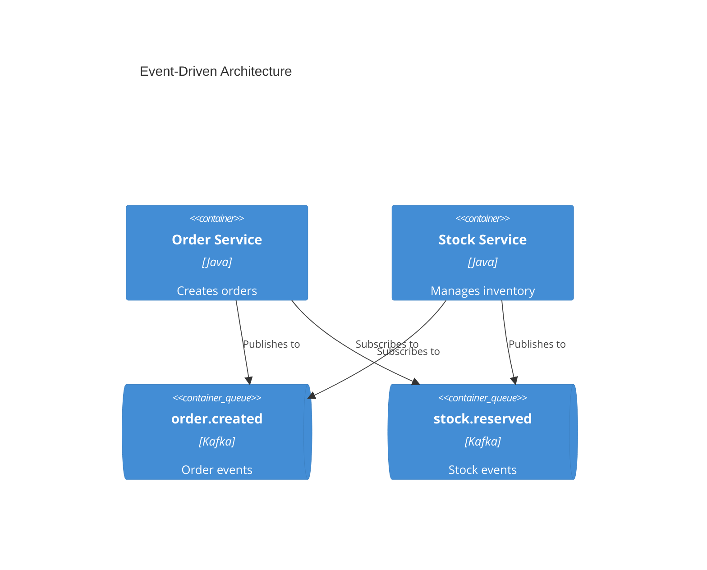

### C4 Best Practices

#### Essential Rules

1. **Every element must have**: Name, Type, Technology (where applicable), and Description
2. **Use unidirectional arrows only** -- Bidirectional arrows create ambiguity
3. **Label arrows with action verbs** -- "Sends email using", "Reads from", not just "uses"
4. **Include technology labels** -- "JSON/HTTPS", "JDBC", "gRPC"
5. **Stay under 20 elements per diagram** -- Split complex systems into multiple diagrams

#### Clarity Guidelines

1. **Start at Level 1** -- Context diagrams help frame the system scope
2. **One diagram per file** -- Keep diagrams focused on a single abstraction level
3. **Meaningful aliases** -- Use descriptive aliases (e.g., `orderService` not `s1`)
4. **Concise descriptions** -- Keep descriptions under 50 characters when possible
5. **Always include a title** -- "System Context diagram for [System Name]"

#### What to Avoid

See [references/common-mistakes.md](references/common-mistakes.md) for detailed anti-patterns:
- Confusing containers (deployable) vs components (non-deployable)
- Modeling shared libraries as containers
- Showing message brokers as single containers instead of individual topics
- Adding undefined abstraction levels like "subcomponents"
- Removing type labels to "simplify" diagrams

### C4 Output Location

Write architecture documentation to `docs/architecture/` with naming convention:
- `c4-context.md` -- System context diagram
- `c4-containers.md` -- Container diagram
- `c4-components-{feature}.md` -- Component diagrams per feature
- `c4-deployment.md` -- Deployment diagram
- `c4-dynamic-{flow}.md` -- Dynamic diagrams for specific flows

## Detailed References

For in-depth guidance on specific diagram types, see:

- **[references/class-diagrams.md](references/class-diagrams.md)** - Domain modeling, relationships (association, composition, aggregation, inheritance), multiplicity, methods/properties
- **[references/sequence-diagrams.md](references/sequence-diagrams.md)** - Actors, participants, messages (sync/async), activations, loops, alt/opt/par blocks, notes
- **[references/flowcharts.md](references/flowcharts.md)** - Node shapes, connections, decision logic, subgraphs, styling
- **[references/erd-diagrams.md](references/erd-diagrams.md)** - Entities, relationships, cardinality, keys, attributes
- **[references/c4-diagrams.md](references/c4-diagrams.md)** - C4 context, container, component diagrams, boundaries, architecture patterns
- **[references/architecture-diagrams.md](references/architecture-diagrams.md)** - Cloud services, infrastructure, CI/CD deployments
- **[references/advanced-features.md](references/advanced-features.md)** - Themes, styling, configuration, layout options
- **[references/c4-syntax.md](references/c4-syntax.md)** - Complete Mermaid C4 syntax reference
- **[references/common-mistakes.md](references/common-mistakes.md)** - C4 anti-patterns to avoid
- **[references/advanced-patterns.md](references/advanced-patterns.md)** - Microservices, event-driven, deployment patterns

## General Best Practices

1. **Start Simple** - Begin with core entities/components, add details incrementally
2. **Use Meaningful Names** - Clear labels make diagrams self-documenting
3. **Comment Extensively** - Use `%%` comments to explain complex relationships
4. **Keep Focused** - One diagram per concept; split large diagrams into multiple focused views
5. **Version Control** - Store `.mmd` files alongside code for easy updates
6. **Add Context** - Include titles and notes to explain diagram purpose
7. **Iterate** - Refine diagrams as understanding evolves

## Configuration and Theming

Configure diagrams using frontmatter:

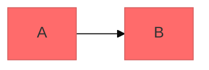

**Available themes:** default, forest, dark, neutral, base

**Layout options:**
- `layout: dagre` (default) - Classic balanced layout
- `layout: elk` - Advanced layout for complex diagrams (requires integration)

**Look options:**
- `look: classic` - Traditional Mermaid style
- `look: handDrawn` - Sketch-like appearance

## Exporting and Rendering

**Native support in:**
- GitHub/GitLab - Automatically renders in Markdown
- VS Code - With Markdown Mermaid extension
- Notion, Obsidian, Confluence - Built-in support

**Export options:**
- [Mermaid Live Editor](https://mermaid.live) - Online editor with PNG/SVG export
- Mermaid CLI - `npm install -g @mermaid-js/mermaid-cli` then `mmdc -i input.mmd -o output.png`
- Docker - `docker run --rm -v $(pwd):/data minlag/mermaid-cli -i /data/input.mmd -o /data/output.png`

## Common Pitfalls

- **Breaking characters** - Avoid `{}` in comments, use proper escape sequences for special characters
- **Syntax errors** - Misspellings break diagrams; validate syntax in Mermaid Live
- **Overcomplexity** - Split complex diagrams into multiple focused views
- **Missing relationships** - Document all important connections between entities

## When to Create Diagrams

**Always diagram when:**
- Starting new projects or features
- Documenting complex systems
- Explaining architecture decisions
- Designing database schemas
- Planning refactoring efforts
- Onboarding new team members

**Use diagrams to:**
- Align stakeholders on technical decisions
- Document domain models collaboratively
- Visualize data flows and system interactions
- Plan before coding
- Create living documentation that evolves with code
